# rm-TaitoAsuka_MiSTer

FPGA core for the Taito hardware behind **Asuka & Asuka** — the family MAME
collects in `asuka.cpp` — targeting the
[MiSTer FPGA](https://github.com/MiSTer-devel) platform (Terasic DE10-Nano).

**One RBF, seven games, all thirty sets of the driver**: *Cadash* (1989),
*Asuka & Asuka* (1988), *Maze of Flott* (1989), *Galmedes* (1992), *U.N.
Defense Force: Earth Joker* (1993), *Kokontouzai Eto Monogatari* (1994) and
*Bonze Adventure* (1988). That includes the two things this family is known
for: the **C-Chip**, the Taito module built around a uPD78C11 that games like
Bonze Adventure route their inputs through, and **Cadash's two-cabinet link**,
here running between two MiSTers over the network or a SNAC cable —
**experimental, and not enabled in this release**.

The core reimplements the hardware in SystemVerilog from the MAME driver, read
line by line — every non-obvious fact in the RTL carries its
`asuka.cpp:<line>` citation in a comment — and, where the driver stops short,
from the program ROMs themselves, disassembled.

---

# The `rm` version

*This section is the same in every `rm` core: it explains what the line is and
what it adds. Skip it if you already know.*

**`rm` cores are my own builds, published outside the MiSTer-devel tree.** On
top of the emulation they carry two things the official tree cannot host,
because both require editing the `sys/` framework and MiSTer-devel does not
take those changes.

### 1. CRT geometry that leaves HDMI alone

**CRT Adjust** (H-Size, H-Position, V-Shift) and **CRT V-Size** let you align
and size the picture on a 15 kHz tube from the OSD, with the sync left native
so the screen never loses lock, and without duplicating or dropping a single
line.

The point of the whole thing is *where* they sit: **sys-side**, in the analog
chain between the scanline stage and the OSD. The scaler taps the video
**before** that point, so **HDMI stays bit-identical while you adjust the
CRT** — you can align a tube without touching what a capture card or a
streaming setup sees.

V-Size offers two modes: **PVM** (retimes the lines — perfect on broadcast
monitors with a wide lock range) and **Cabinet** (native timing, photometric —
the sync stays rock-steady on arcade chassis with tight AFC).

### 2. Pause overlay

Logo, supporters list and scrolling credits, shown while the game is paused,
laid out for the real screen in both orientations — 320x240 for the horizontal
games, 240x320 for the vertical ones.

### Naming

| | |
|---|---|
| repository / folder | `rm-<Title>_MiSTer` |
| Quartus project and RBF | `rm<Title>` |
| MRA files | `rm <Title> (…).mra` |

The `rm` RBF has a **different file name** from the official core, so the two
can sit on the same SD card without overwriting each other, and you choose
which one to launch from the MRA.

---

## About the games

**Cadash** (1989) is a side-scrolling action RPG for two players, with four
character classes and a timer that runs the whole game. Its most unusual
feature is the **link**: two cabinets, each with its own PCB, joined by a
serial cable so that four players share one world. The second board carries an
HD64180 (Z180) and a block of shared RAM; the two 68000s never talk directly,
they talk through those.

**Asuka & Asuka** (1988) is the vertical shooter the family is named after,
with a transforming helicopter and a bomb that clears the screen.

**Maze of Flott** (1989) is a top-down maze game in which you drive a car
through a grid of streets, **Galmedes** (1992)
and **U.N. Defense Force: Earth Joker** (1993) are vertical shooters by Visco,
and **Kokontouzai Eto Monogatari** (1994) — "Eto Monogatari" — is a picture
puzzle by Visco built around the animals of the Chinese zodiac.

**Bonze Adventure** (1988), *Jigoku Meguri* in Japan, is a platformer in which
a buddhist monk walks through the Japanese hells. It is the odd one of the
family: no I/O chip, DIP switches read straight off the bus, a YM2610 instead
of YM2151 plus MSM5205 — and the **C-Chip**.

## Status

**Current version: 1.0** (September 2026).

All thirty sets boot and play. The core has been tested on real hardware
throughout development, and every fix in it was verified on the MiSTer, not in
simulation.

| Game | Sets | Notes |
|---|---|---|
| Cadash | 13 | link between two MiSTers — experimental, not in this release |
| Asuka & Asuka | 3 | World, Japan, Japan rev 1 |
| U.N. Defense Force: Earth Joker | 4 | sets 1-3 and the prototype |
| Maze of Flott | 1 | |
| Galmedes | 1 | |
| Kokontouzai Eto Monogatari | 1 | |
| Bonze Adventure | 7 | C-Chip emulated, not simulated |

---

# The C-Chip

Taito's **TC0030CMD** is not a protection chip you can answer with a lookup
table. It is a module with four dies inside one package: a **uPD78C11**
microcontroller with 4 KB of mask ROM, an 8 KB EPROM that changes per game,
8 KB of SRAM shared with the 68000 through banked 1 KB windows, and an ASIC
that holds the bank registers and drives /DTACK.

On Bonze Adventure the player inputs do not reach the 68000 at all: they are
wired to the microcontroller's port pins, and the 68000 reads them back from
the shared RAM, where the C-Chip has put them. Without the chip running its own
firmware the game does not move.

This core runs the **real firmware on an HDL model of the MCU**:
[`jttc0030cmd`](https://github.com/jotego/jtcores) by **Andrea Bogazzi**
wrapping **Raki**'s `IKA87AD`, a uPD78C11 reconstructed from the decapped die
and the NEC datasheet. Both ROMs are loaded from the MRA; the mask ROM is the
same for every C-Chip game, and the MRA looks for it in `bonzeadv.zip` **and**
in a separate `cchip.zip`, so it works whichever way your set is organised.

---

# Cadash, two MiSTers

> **Experimental — not available in this release.** The link runs on the
> bench, but it is still under test, so it ships disabled. It will be
> enabled in a later release, once two-cabinet play has been verified end
> to end.

The link is the part of this core that has no equivalent anywhere else. On the
original hardware two complete cabinets are joined by a serial cable; each PCB
carries an **HD64180 (Z180)** whose only job is to move bytes between the two
boards, and 4 KB of RAM shared with the game's 68000.

Here the Z180 is emulated, its ROM runs, and the serial side is carried either
**over the network** between two MiSTers or through a **SNAC cable** on the
user port. The OSD picks the transport and the wiring.

What makes it work is the part that is not in any datasheet: who starts first,
what happens when one of the two is reset, and what the other does while it
waits. Those rules were worked out by watching the Z180's own program counter
on real hardware, and they are written down in the core.

---

## What else is in the core

- **Four memory maps**, one per hardware variant in the driver — Cadash, the
  Asuka family, Eto Monogatari and Bonze Adventure — selected at load time by a
  byte in the MRA, not by a build-time switch. One bitstream covers all of them.
- **Savestates**, through the framework's savestate bus.
- **Screen rotation** for the vertical games, with the analog output untouched:
  the rotation is done in the HDMI framebuffer, so a CRT never changes path
  when you turn it on.
- **Layer offsets** in the OSD, per layer and per axis, for fine alignment.
- **Sprite Timing** on Cadash, described below.
- **Volume controls** for FM and ADPCM, and a MAME-compatible PSG mode.

### Sprite Timing: Sync or PCB — Cadash only

On a real Cadash board the sprites shift slightly while the screen scrolls and
settle when it stops. That is not a bug, it was confirmed on a genuine PCB, and
MAME does not reproduce it. The OSD lets you pick which behaviour you want —
**on Cadash only**, because Cadash is the board the evidence comes from. Every
other game in the core runs in Sync, and the option is not shown for them. If
evidence turns up for another board, it will be added.

**Sync**, the default, keeps sprites and background welded together, the way
the emulator shows them, and gets there the way the hardware would have to. At
the vblank MAME draws the whole frame in one instant, *before* the 68000 enters
the interrupt handler. So the core takes a single photograph: one pulse, one
clock wide, starts the vblank interrupt, the freeze of the eight TC0100SCN
scroll registers, the copy of the rowscroll and colscroll tables, the freeze of
the PC090OJ control register and the copy of the sprite RAM. Nothing has a
schedule of its own, so nothing can drift.

The copies take 11 to 20 microseconds, and for that time a CPU write to sprite
RAM or VRAM is held — DTACK simply does not arrive — so each copy *is* the
state of that clock by construction, whatever the game happens to be doing.

The sprite buffer is not the same on every board. `set_usebuffer(true)` is on
for Cadash, Asuka & Asuka, Galmedes and Earth Joker: there the frame shows the
scroll of one vblank together with the sprites copied at the *previous* one,
and the core reproduces exactly that. Maze of Flott, Eto Monogatari and Bonze
Adventure have no buffer, and use a single copy.

**PCB** reproduces the board instead, with the sprite photograph taken at the
last line of the frame and the background read live — roughly two pixels of
slip while scrolling.

---

## Sets provided

| Game | Sets |
|---|---|
| Cadash | World, World prototype, Japan, Japan rev 1, Japan rev 2, US rev 1, US rev 2, France, Germany, Germany rev 1, Italy, Spain, Spain rev 1 |
| Cadash link | World, as master and as slave — experimental, not in this release |
| Asuka & Asuka | World, Japan, Japan rev 1 |
| U.N. Defense Force: Earth Joker | sets 1, 2, 3 and the Japanese prototype |
| Maze of Flott | Japan |
| Galmedes | Japan |
| Kokontouzai Eto Monogatari | Japan |
| Bonze Adventure | World rev 1, World, US rev 1, *Jigoku Meguri* Japan and Japan rev 1, and the two World prototypes |

## Screenshots

**Yoko** is the board's native raster on a horizontal screen, **Tate** is the
picture rotated upright, as on a vertical cabinet.

| | |
|---|---|
| 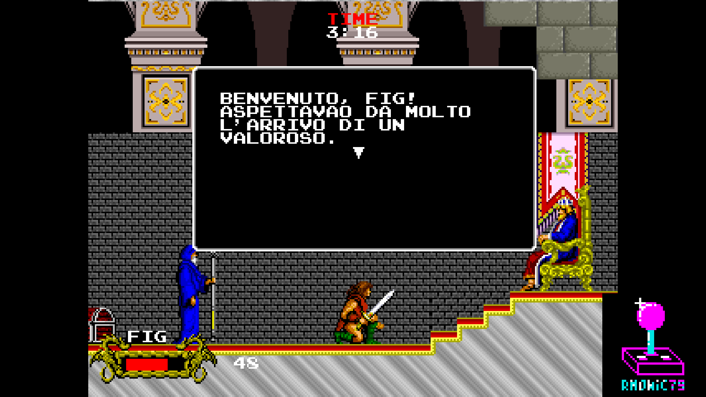 | 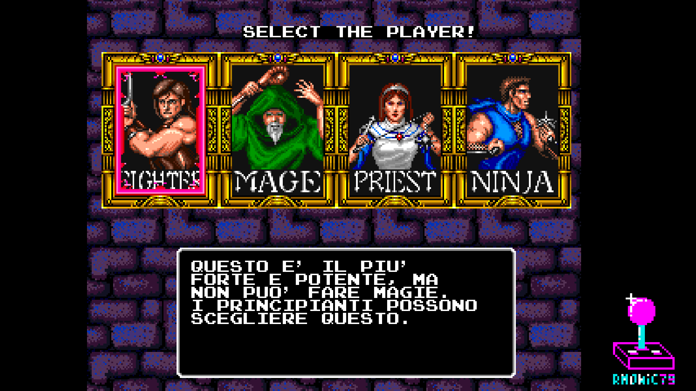 |
| Cadash — starting out | Cadash — the four classes |
| 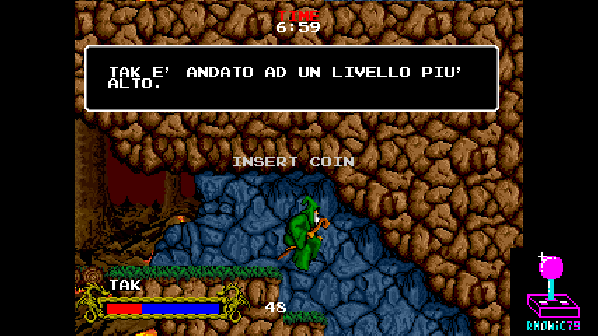 | 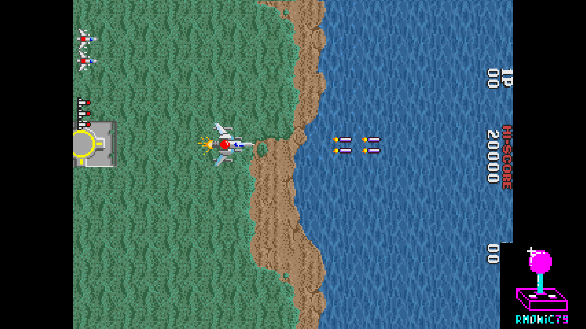 |
| Cadash — underground | Asuka & Asuka — yoko |
| 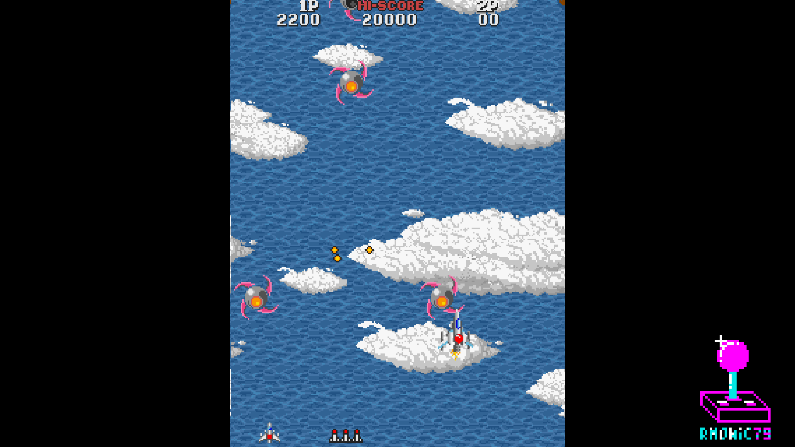 | 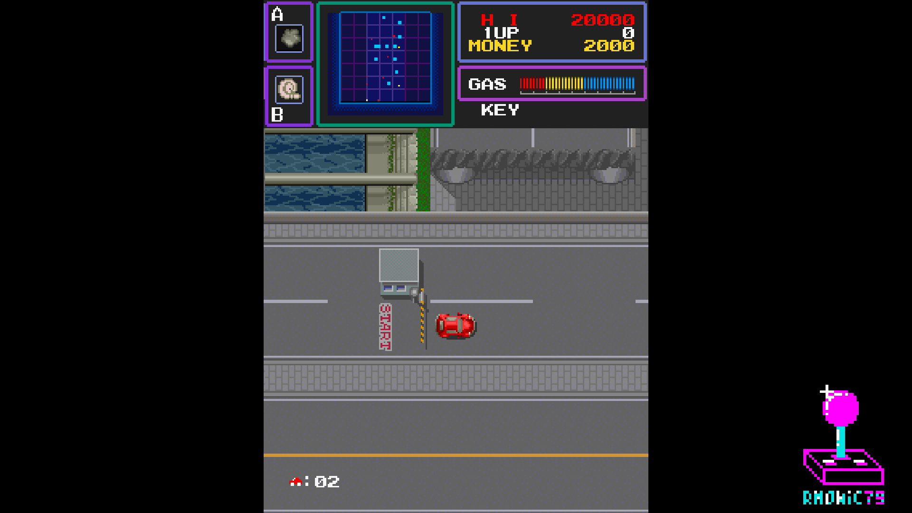 |
| Asuka & Asuka — tate | Maze of Flott — tate |
| 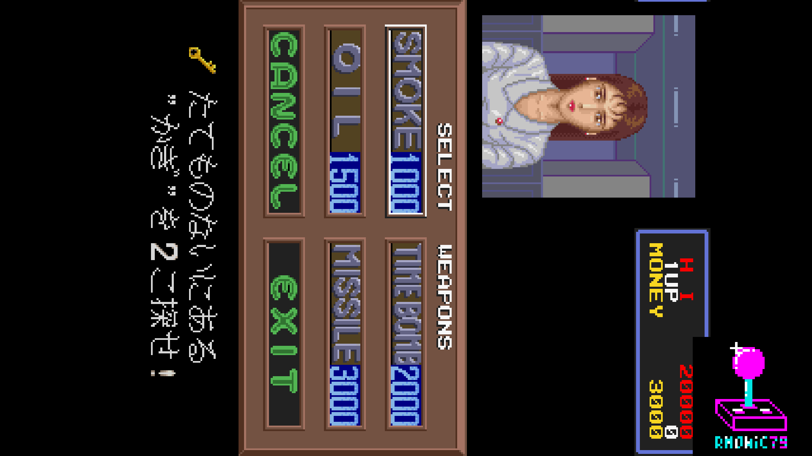 | 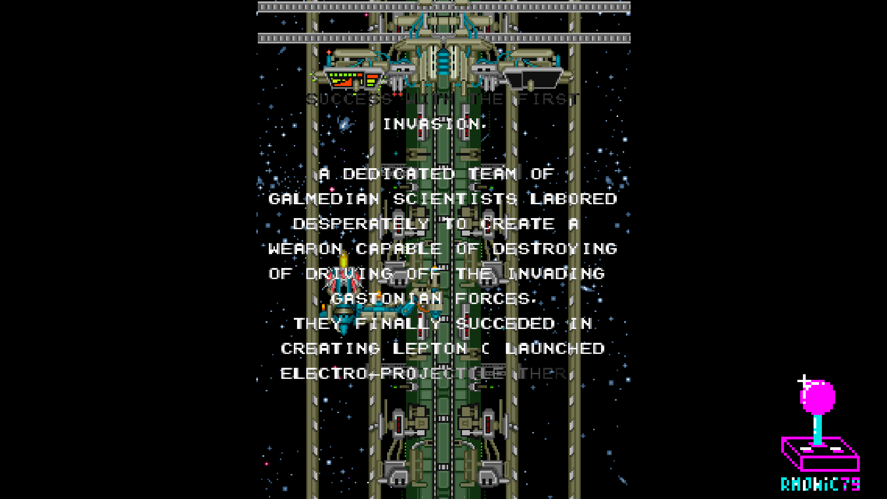 |
| Maze of Flott — yoko | Galmedes — intro, tate |
| 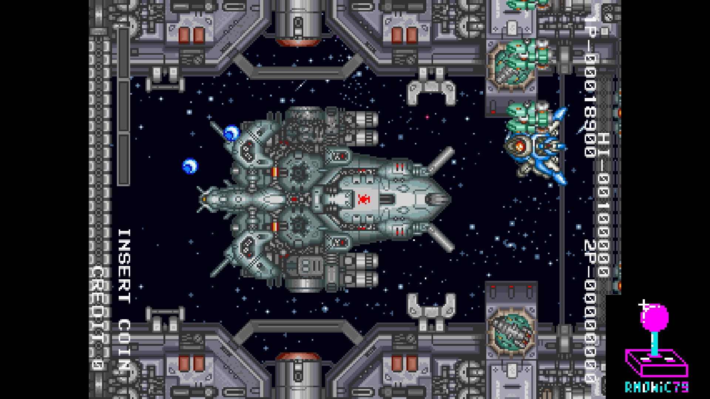 | 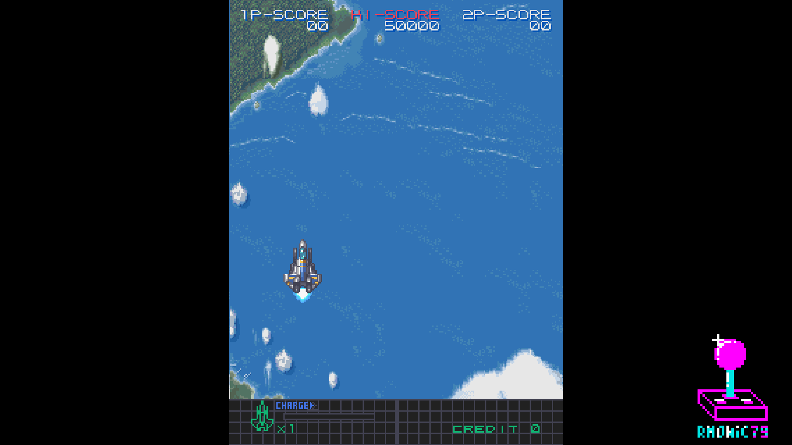 |
| Galmedes — yoko | Earth Joker — tate |
| 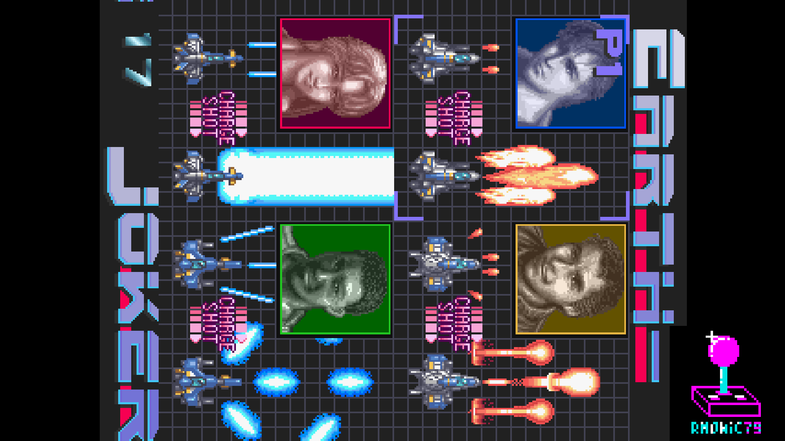 | 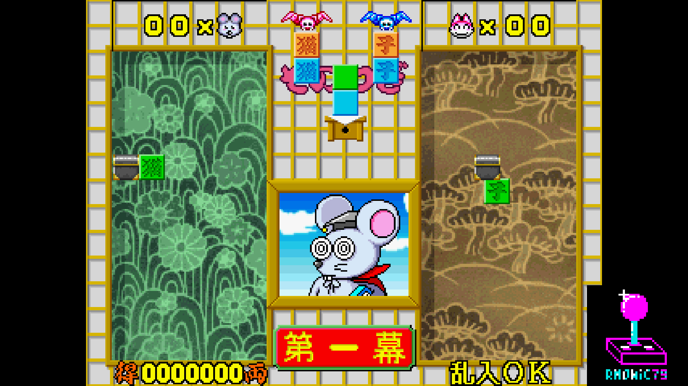 |
| Earth Joker — yoko | Eto Monogatari — playing |
| 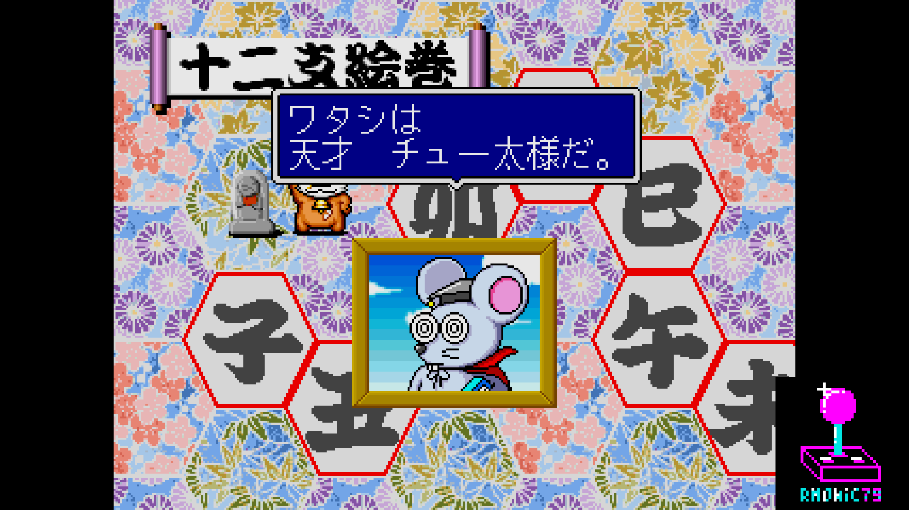 | 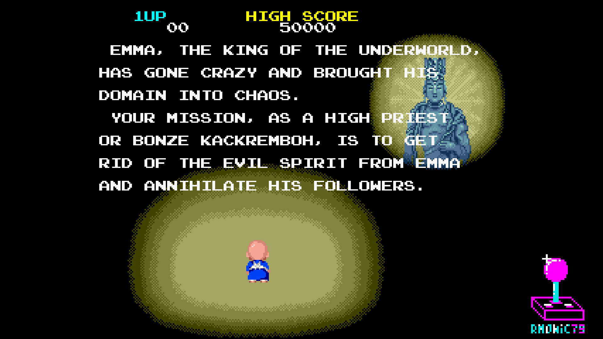 |
| Eto Monogatari — the board | Bonze Adventure — intro |
| 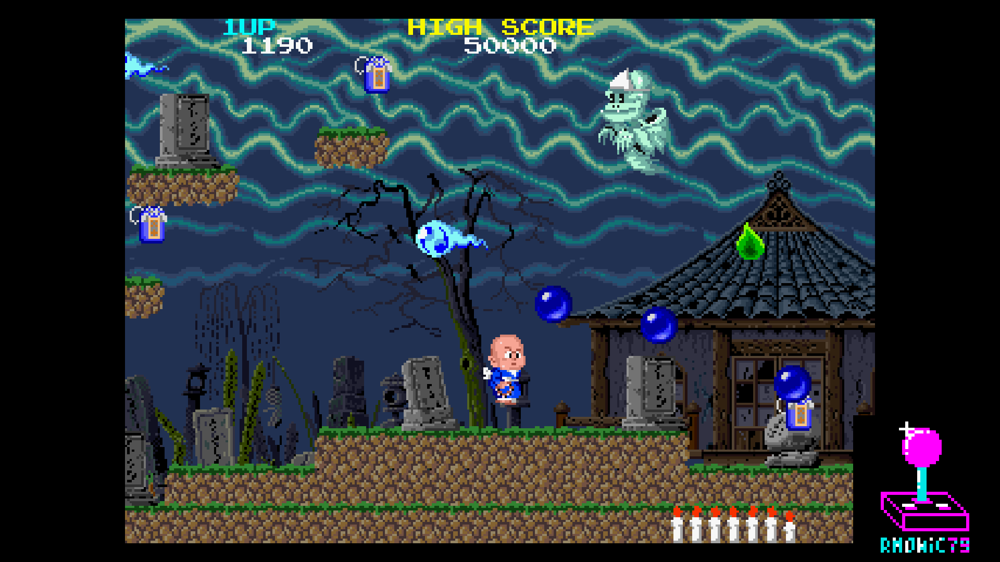 | |
| Bonze Adventure — playing, C-Chip and all | |

## Hardware emulated

| Component | Spec |
|---|---|
| Main CPU | 68000 @ 16 MHz on Cadash (32/2), @ 8 MHz on the rest (16/2) |
| Sound CPU | Z80 @ 4 MHz |
| Link CPU | HD64180 (Z180) @ 8 MHz — Cadash only |
| Protection | **TC0030CMD C-Chip**: uPD78C11 + 4 KB mask ROM + 8 KB EPROM + 8 KB shared SRAM + ASIC — Bonze Adventure |
| Sound chips | **YM2151** @ 4 MHz + **MSM5205** @ 384 kHz; **YM2610** @ 8 MHz on Bonze Adventure |
| Sound comm | PC060HA / **TC0140SYT** |
| Tilemaps | **TC0100SCN** — BG0, BG1 and text, with rowscroll |
| Sprites | **PC090OJ**, 16×16, with buffered sprite RAM |
| Palette | **TC0110PCR**, 4096 colours — xBGR444 on Cadash, xBGR555 on the rest |
| I/O | **TC0220IOC** — Bonze Adventure reads its DIP switches straight off the bus |
| Raster | 436 × 262 @ 6.857 MHz → 320×240 visible, 15.727 kHz, 60.03 Hz |

The raster comes from the board's own video crystal: 26.686 MHz divided by four
is 6.6715 MHz, a line of 424 pixels and a field of 262 lines. From 96 MHz no
whole divider gives that pixel clock, so the core uses 96/14 and chooses the
totals to land on the two frequencies that matter — line and field come out
within **0.04%** of the real board.

## Hardware requirements

- Terasic DE10-Nano
- MiSTer I/O board (recommended)
- SDRAM module
- Works on HDMI displays and on CRTs via the analog video output
- For the Cadash link (experimental, not enabled in this release): two MiSTers
  on the same network, or a SNAC cable between the two user ports

## Building from source

Requires Quartus Prime 17.0 (free Lite Edition).

```
Open rmTaitoAsuka.qpf in Quartus → Processing → Start Compilation
```

Output bitstream is generated in `output_files/rmTaitoAsuka.rbf`.

## Running on MiSTer

The [releases/](releases/) folder contains the MRAs and a prebuilt bitstream.

1. Copy the dated `.rbf` to `_Arcade/cores/` on the MiSTer SD card, named
   `rmTaitoAsuka.rbf` — that is the name the MRAs look for.
2. Copy the parent MRAs from `releases/` to `_Arcade/`, and the
   `_alternatives/` folder alongside them if you want the other sets.
3. Provide your legally-owned merged `cadash.zip`, `asuka.zip`, `mofflott.zip`,
   `galmedes.zip`, `earthjkr.zip`, `eto.zip` and `bonzeadv.zip` where the MRAs
   expect them (usually in `games/mame/`).

**ROMs are NOT included in this repository.** You must provide them yourself.

## Acknowledgements

- **David Graves** and **Brian Troha**, authors of MAME's `asuka.cpp`, with
  thanks to **Richard Bush**, and the **MAMEDev team** — memory maps, raster
  timing, graphics layouts and mixing ratios come from there, and the RTL cites
  the driver line by line.
- **Jonathan Gevaryahu** and **David Haywood** for MAME's C-Chip device, the
  reference the chip's behaviour was checked against.
- **Raki** for **IKA87AD**, the uPD78C11 model reconstructed from the decapped
  die and the NEC datasheet, and **Andrea Bogazzi**
  ([@asturur](https://github.com/asturur)) for **jttc0030cmd**, the C-Chip
  around it. Andrea also helped on one part of the CRT Adjust module during its
  development.
- **Jose Tejada** ([@jotego](https://github.com/jotego)) for **jt51** (YM2151),
  **jt12/jt10** (YM2610), the **JTFRAME** framework and its SDRAM64 controller.
- **Martin Donlon** ([wickerwaka](https://github.com/wickerwaka)) for the
  savestate infrastructure and for the TC0110PCR and TC0140SYT models.
- **Daniel Wallner** for the **T80** Z80 CPU core, and **Sorgelig** for its
  MiSTer updates.
- **Sorgelig** and the **MiSTer-devel team** for the framework, the SDRAM
  controller, the DDR3 interface and the Template.

## Support this project

If you enjoy this core and want to support its development:

- [Ko-fi](https://ko-fi.com/ibecerivideoludici) — one-time support
- [Patreon](https://www.patreon.com/IBeceriVideoludici) — monthly support
- [PayPal](https://www.paypal.me/IBeceriVideoludici) — one-time donation

## Follow

- [GitHub](https://github.com/rmonic79)
- [Twitch](https://twitch.tv/ibecerivideoludici) — live streams
- [YouTube](https://www.youtube.com/c/IBeceriVideoludici) — playlists and videos
- [X / Twitter](https://x.com/rmonic79)

## License

The RTL source code in this repository is provided as-is for educational
and preservation purposes under **GNU GPL v3 or later**. Original ROM data
is not included; users must provide their own legally obtained copies.

Original *Cadash*, *Asuka & Asuka*, *Maze of Flott*, *Bonze Adventure*
© Taito Corporation, 1988–1989. *Galmedes*, *U.N. Defense Force: Earth Joker*
and *Kokontouzai Eto Monogatari* © Visco Corporation, 1992–1994.
